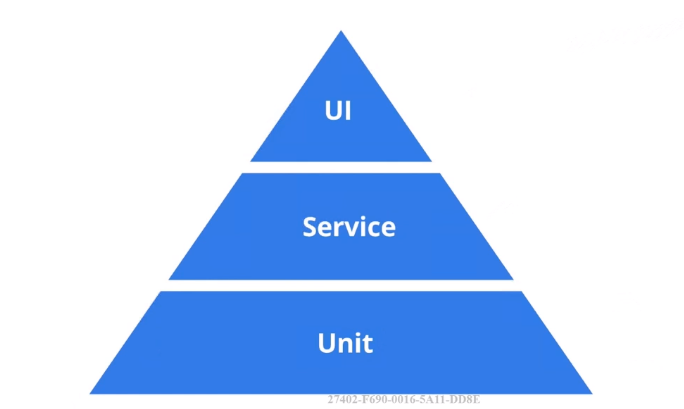
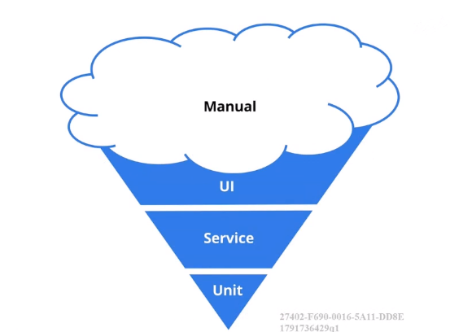

# react 在线账本

## 设计稿-从蓝图开始

### 拆分页面：根据原型图很直观的拆分

- 首页：列表模式
- 新建记账条目页
- 编辑记账条目页（有可能和新建共用）
- 首页：图表模式（有可能和首页共用）

## 代码文件机构，代码和文件命名规范

- 代码结构和文件命名的重要性
- 用 create-react-app 创建工程模板
- 展示型组件
  - 关心数据的展示方式
  - 不依赖 app 中的其他文件
  - 不关心数据是如何加载和变化的
  - 仅通过 props 接收数据和回调函数
  - 除非需要用到 state，生命周期函数或性能优化，同常写成函数式组件
- 容器型组件

  - 关心数据的运作方式
  - 为展示型组件提供数据和操作数据的方法
  - 为展示型组件提供回调函数
  - 通常是有状态的，并且作为数据源存在

- components 文件夹存放所有的展示型组件
- containers 文件夹存放所有的容器性组件
- 这两个文件夹下的 `__test__` 文件夹存放所有组件测试文件
- 文件使用 Pascal Case 命名法
- src 根目录下放统一使用的一些文件

使用 create-react-app 创建的项目自带 ESLint 规范，查看规范：<https://github.com/JasonBoy/javascript/tree/master/react>

## React 理念

- React 官方推荐的开发 React 应用的思考方式
- <https://react.docschina.org/docs/thinking-in-react.html>

### React 理念步骤初步理解

- 第一步：把 UI 划分出组件层级
- 第二步：创建应用的静态版本

## 为项目选择图标库

- 使用 svg 图标库而不是 font icon
  - svg 可以完全的控制用任何的 css，font icon 本身是字符，所以只能使用字符相关的属性
  - 使用 font icon 经常要下载大的字体文件
  - font icon 的语义性、可访问性差
- 很多 free icon set - icomoon、Ionicons
  - 这里我们选择 Ionicons - <https://ionicons.com/>
  - 结合 react 的库选用 react-ionicons

## 使用 PropTypes 检查类型属性

- 类型检查可以帮助我们更好的发现 bug
- React 内置了 PropTypes 来完成这个任务
- Props 默认的值：defaultProps

### 复杂的静态组件-月份选择

## State 设计原则

- 最小化 State 原则
- DRY
- 有些数据可以根据 state 计算得出

### 首页 state 分析

## 组件测试

### 国内互联网测试现状

- 重视程度严重不足
- 没有时间
- 不会写测试

### 测试是什么和重要性

- 高质量的代码
- 更早的发现 Bug，减少成本
- 让重构和升级更加容易和可靠
- 让开发流程更加敏捷

### 测试金字塔

- UI e2e
- Service 几个 Unit 组合
- Unit 单元测试

### 现在很多公司现状

### React 特别适合单元测试

- 组件化
- Function Component
- 单向数据流

### 通用测试框架 Jest

- 通用测试框架
- 支持多平台，运行速度极快
- 内置代码覆盖率
- 为 React 提供了一些特殊的测试方法

### 断言库

- 判断一个值是否对应相应的结果
- <https://jestjs.io/docs/en/using-matchers>
- 其他断言库：chai 等等

### React 测试工具

- React 官方测试工具 - ReactTestUtils
- Airbnb 基于官方的封装 - Enzyme

### Enzyme 优点

- 简单 易懂
- 类似 jQuery 链式写法

#### 两种测试方法

- shallow Rendering：React 组件返回的是一系列 Virtual DOM 对象，这个方法是生成 vm 实例，然后测试它的属性，它不会渲染组件中的子组件
- DOM Rendering：渲染的是一个真实的 DOM 环境，速度较慢

yarn add -D enzyme enzyme-adapter-react-16

### Snapshot testing

- Jest 为 React 测试提供的特性
- 为价格列表添加 snapshot

## 首页单元测试用例分析

- 测试默认状态 - 是否正确渲染特定组件和数据
- 测试交互 - 点击交互该组件的 state 是否有相应的修改
- 测试交互 - 对应操作触发以后展示型组件的属性是否修改

## 使用 React-Router 开发 SPA 应用

## TDD 的开发流程

## Flatten State

- 解决数据冗余
- 处理数据高效方便

## 简单谈谈 Redux

- Redux is a predictable state container for JavaScript apps
- 一种特殊的数据结构
- 使用一些特殊的方法来实现数据的更改
- 不是 React 特有的

### 为什么不使用 Redux

- 学习成本
- 增加数据流复杂度
- 需要增加太多的模板（Boilerplate）代码

## 前后端分离开发和 mock server

前端有一个自己的开发服务器，不需要在依赖后端服务器来支持项目的运行，摆脱对后端接口的依赖。

前端开发注重于页面逻辑的实现，接口的参数、返回方法等双方都可以使用 Restful 的接口类，接口规范。

### 前后端分离开发的优点

- 为优质产品打造精益团队，培养双方独特的技术特性
- 提升开发效率，前后端代码解耦，只要前后端沟通约定，应用所需的接口与参数，然后就可以并行开发。
- 完美应变复杂多变的前端需求：开发独立化，开发人员做到专注专精，开发能力完美提升。
- 增强代码的可维护性

### 优秀的 mock server 应该有的特性

- 快速搭建
- 支持标准的 Restful 操作
- 支持标准的 Restful 路由规则：<https://restfulapi.net/resource-naming/>
- 一些进阶扩展，比如说自定义路由、中间件支持 等等

### 使用 json-server 打造 mock server

<https://github.com/typicode/json-server>

### 分析应用的接口

- `/items - GET，POST`
- `/items/{id} - GET，PUT，DELETE`
- `/items?monthCategory=2018-8&_sort=timestamp - GET`
- `/categories - GET，POST`
- `/categories/{id} - GET，PUT，DELETE`

### 使用 postman 测试 API 接口

<https://www.getpostman.com/>

- 支持各种操作系统
- 有非常简洁易用的界面
- 可以支持 API 测试的导出，很容易分享给其他开发

PUT 与 PATCH 的区别

## 下一代的 HTTP 库：Axios

### Fetch 的缺点

- 只对网络请求报错，对 400，500 都当作成功的请求
- 默认不带 cookie
- 不支持 abort，不支持超时控制，不能阻止请求过程，继续在后代运行，造成流量的浪费
- 没有办法原生监测请求的进度

### Axios

<http://github.com/axios/axios>

- 浏览器和 node 环境都可以使用
- 完全支持标准的 Promise API
- 简单易用的 API
- 取消请求，JSON 数据自动转换 等等功能

## 添加图表分析

### 怎么选择一个好的开源库

- 从它的主页和 Github 项目了解信息
- 使用 npm-stat 分析下载量
- 使用 npm view 查看发布频率

### 学习 Recharts 的基本使用

## 生产环境和开发环境的异同

### 开发环境

- 有尽量丰富的信息帮助程序员定位问题
- 使用本地的 mock 数据

### 生产环境

- 尽量消除程序错误和调试信息
- 使用线上真实数据
- 访问速度是第一要务

### 不同应用对于两种环境的适配

- express 对于两种不同环境的优化
- React 对于两种不同环境的优化

## 服务器的不同类型

### shared host 和 VPS

### Cloud Hosts

云主机，the future of web hosting，把大量的 server 组合在一起，形成一个聚合的网络，也可以叫做集群，分配给你的资源可以从资源池中动态的抽取，当你不使用资源时会自动的回收，有很棒的扩展性，你需要的资源可以根据你的需求自动的扩容，环境不需要自己安装。PSS、saas。

## 云平台部署

LeanCloud <https://leancloud.cn>

## 总结

- 对测试的重视，尽量给代码写测试
- 举一反三，触类旁通的发散性思维
- 自我学习和自我解决问题的能力
